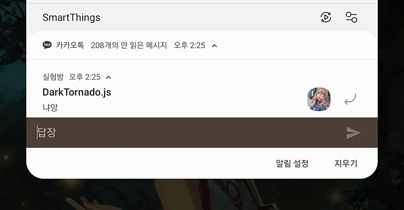

# 비공식 카카오톡 봇으로 구현할 수 없는 것

## 비공식 카카오톡 봇의 작동 방식
* 채팅 수신 인식 : 상단바에 카톡 알림이 뜨면, 그 알림에 접근하여 누가 어디서 뭐라고 보냈는지 가져옴.
* 채팅 전송 : 상단바에 뜬 카톡 알림을 통해 응답 전송이 가능하니, 알림을 통해 응답 전송

## 구현할 수 없는 것
* 상단바에 뜬 카톡 알림에서 할 수 없는 모든 것
* 나중에 정리해서 작성할 예정
